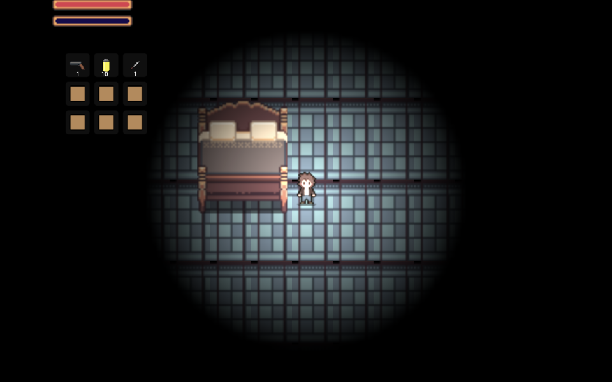
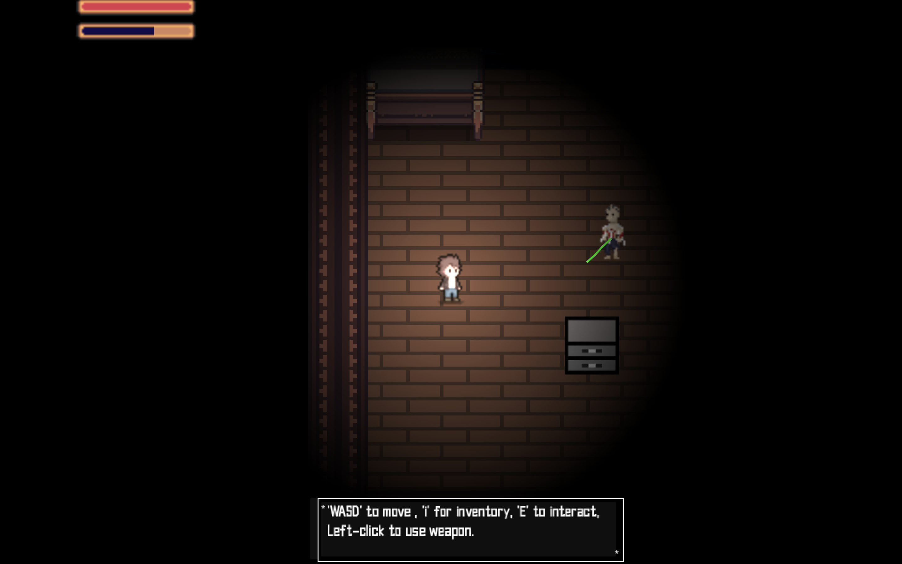
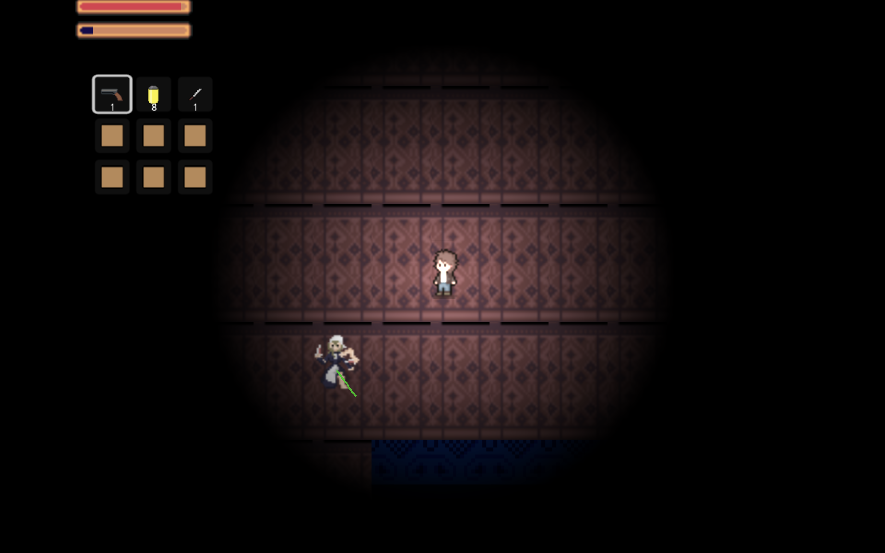

# Resident Medieval Press Kit

## 1. Game Overview
- **Title:** Resident Medieval
- **Genre:** [e.g. Top Down Horror Survival]
- **Developers:** [Elmer Leon, Noah Chang, Andrew Lov, Jose Miguel Romero, Sween Zhou]
- **Support:** Any device that supports and runs Godot
- **Trailer:** [https://youtu.be/uClh8eequVQ]

## 2. Game Description
Resident Medieval is about finding your way out of a Victorian -Gothic mansion while having to defeat any enemies trying to take you out. Figure out environment interactable puzzles while maintainig your resources found throughout the map.

**Key Features:**
- Puzzle rooms leading to your escape
- Crates filled with resourced to aid your escape
- Inventory system to manage your items
- Mobs scattered around the rooms with different mechanics
- Weapons to aid your survival

## 3. Gameplay & Mechanics
**Core Mechanics:**
- fatigue builds as you sprint
- wepaons such as pistols and knives
- interactable object like doors and crates

**Progression:**
- Find the door to move to the next room
- Some doors need keys 

**Tips and Tricks:**
- Text based UI will give hints for puzzles
- Use resources wisely 

## 4. Art and Audio
**Art Style:**
- 2d art and animations
- Audio adds a horror and eerie vibe

**Screenshots:**  
- 
- 
- 
- 
- 

## 7. Team & Credits
- Elmer Leon: UI/Input,Press Kit and Trailer
- Jose Miguel Romero: Animation and Visuals, Audio
- Sween Zhou: Movement/Physics/Architect, Game AI
- Andrew Lov: Producer, GamePlay Testing
- Noah Chang: Game Logic, Game Feel
