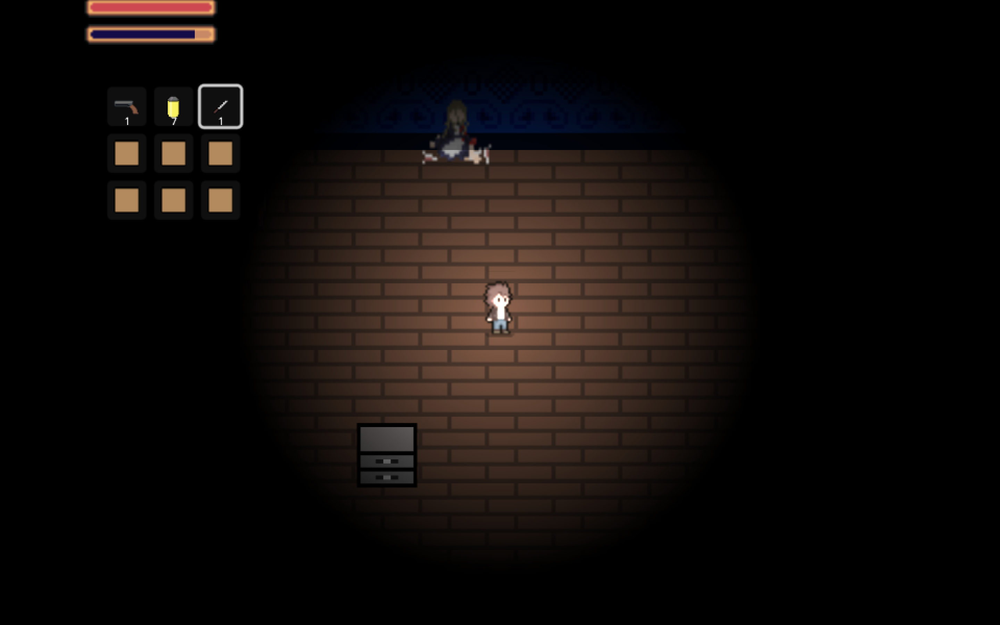

# Resident Medieval #

IMPORTANT: Converting our Godot project to HTML caused the web version of the game to break. Please play the game by downloading the zip file called ResidentMedieval.zip and launching Godot using this link: https://drive.google.com/file/d/1tfXmzc50zvNG8Jq4TXfSyPP31eo42mPe/view?usp=sharing. The game works with no issues this way.

## Summary ##

An action horror game set in a dark and eerie Victorian-era Gothic mansion, where your primary goal is to escape the nightmarish environment. As the game begins, you wake up alone in a dimly lit room, disoriented and with no recollection of how you arrived. The unsettling silence is broken only by distant, chilling noises, setting the tone for the terrifying journey ahead. Driven by a mix of fear and curiosity, you start to explore the shadowy corridors and decrepit streets, only to discover that the place is teeming with hostile, "infected" individuals who are out for blood. To survive, you must navigate a labyrinth of interconnected rooms, passageways, and outdoor areas, all while solving puzzles, using weapons, and piecing together the mansion’s dark secrets. The infected are relentless, and your limited supply of resources forces you to make tough decisions: do you risk engaging them head-on, or attempt to sneak past unnoticed?

**A paragraph-length pitch for your game.**

Resident Medieval is a pulse-pounding action-horror game where you must navigate a sinister mansion teeming with infected enemies, solve cryptic puzzles, and make life-or-death decisions to survive the night. Fight or flee as you uncover the mansion’s dark secrets, all while conserving your limited resources to make it out alive. Action-horror games often focus on combat or stealth, but Resident Medieval blends both with a resource-constrained survival element and intricate environmental puzzles. There is always constant tension between engaging enemies and sneaking past them adds a unique, strategic layer to the gameplay. Jump into the action and give it a try!

## Project Resources
IMPORTANT: Converting our Godot project to HTML caused the web version of the game to break. Please play the game by downloading the zip file called ResidentMedieval.zip and launching Godot using this link: https://drive.google.com/file/d/1tfXmzc50zvNG8Jq4TXfSyPP31eo42mPe/view?usp=sharing. The game works with no issues this way.

[Web-playable version of your game.](https://noahmchang.itch.io/resident-medieval) Password: 11037 (SEE NOTE ABOVE)

[Trailor](https://youtu.be/uClh8eequVQ?feature=shared)  
[Press Kit](PressKit.md)  
[Proposal](https://docs.google.com/document/d/1M7M3UT2rDdXSgoVlukvLziJDm2PqogjL-ExfxdbDmNA/edit?usp=sharing)  

## Gameplay Explanation ##

Controls are WASD to move, shift to run, E to interact, left click to use weapon, I for inventory, #1-9 to select inventory slot. Interact with cabinets to obtain items. In some rooms, enemies will be constantly spawned from spawners, so running from them is a valid way to play the game. In terms of weaponry, there is a knife which is unlimited and a pistol which takes ammo. There are three times of enemies, normal melee zombies, ranged zombies, and slasher zombies which are slightly stronger. Enemy AI gets alerted by player and follows player through ray casting. The first puzzle is a room where you have to interact with the cabinets in a certain order to unlock the door. There will be a hint based on the text (2:00 then 5:00) and the clock pattern on the carpet. When at the second puzzle, the player notices that there is no door for the next room. The player must interact with the matches on a cabinet to burn away the firewood in the fireplace to unlock a passage.

NOTE: You aim by your mouse position (even your knife).

**In this section, explain how the game should be played. Treat this as a manual within a game. Explaining the button mappings and the most optimal gameplay strategy is encouraged.**

Optimal strategy would be a mix of fighting and running when you get overwhelmed by enemies. As mentioned, the you can select items in your inventory by using the the 1-9 keys. Save your pistol for tough enemies since you will only receive a small amount of ammo. Switch to your knife on weaker enemies since the knife can be used without any cost. Finally, run by holding the shift key in short bursts to make sure you do not get fatigued. The health and fatigue bar can be viewed at the top-left of the screen.

**Add it here if you did work that should be factored into your grade but does not fit easily into the proscribed roles! Please include links to resources and descriptions of game-related material that does not fit into roles here.**

# External Code, Ideas, and Structure #

If your project contains code that: 1) your team did not write, and 2) does not fit cleanly into a role, please document it in this section. Please include the author of the code, where to find the code, and note which scripts, folders, or other files that comprise the external contribution. Additionally, include the license for the external code that permits you to use it. You do not need to include the license for code provided by the instruction team.

If you used tutorials or other intellectual guidance to create aspects of your project, include reference to that information as well.

Our group did not use code from any external source. However, we referenced the Godot Docs to understand how to implement certain features: https://docs.godotengine.org/en/stable/index.html

# Main Roles #

Your goal is to relate the work of your role and sub-role in terms of the content of the course. Please look at the role sections below for specific instructions for each role.

Below is a template for you to highlight items of your work. These provide the evidence needed for your work to be evaluated. Try to have at least four such descriptions. They will be assessed on the quality of the underlying system and how they are linked to course content. 

*Short Description* - Long description of your work item that includes how it is relevant to topics discussed in class. [link to evidence in your repository](https://github.com/dr-jam/ECS189L/edit/project-description/ProjectDocumentTemplate.md)

Here is an example:  
*Procedural Terrain* - The game's background consists of procedurally generated terrain produced with Perlin noise. The game can modify this terrain at run-time via a call to its script methods. The intent is to allow the player to modify the terrain. This system is based on the component design pattern and the procedural content generation portions of the course. [The PCG terrain generation script](https://github.com/dr-jam/CameraControlExercise/blob/513b927e87fc686fe627bf7d4ff6ff841cf34e9f/Obscura/Assets/Scripts/TerrainGenerator.cs#L6).

You should replay any **bold text** with your relevant information. Liberally use the template when necessary and appropriate.

## Producer - Andrew Lov

**Describe the steps you took in your role as producer. Typical items include group scheduling mechanisms, links to meeting notes, descriptions of team logistics problems with their resolution, project organization tools (e.g., timelines, dependency/task tracking, Gantt charts, etc.), and repository management methodology.**

My role as the producer of our game was acting as an organizer/overseer of the development, and also helping out to do tasks that didn't have anyone explicitly assigned to it. There were a lot of tasks that I did contribute to, including level desgin, puzzle implementation.

Part of my job as producer had been alleviated by the format of how our group functioned, as Sween had handled the base creation of the shared Github repository that we all worked on. From the way that our architect wanted to lay the foundation of our code, Sween created a playable version of our game that had all necessary mechanics and scripts to create the rest of the game ourselves, where we could work independently of one another. This was really helpful, and Sween did this on his own accord.

There were other things that I laid out that would help in the course of development of our game, including a Gantt Chart that would show the order in which our group should proceed in for development 

I did schedule meetings together for our group, and provided resources that could be referenced by the other group members. It was definitely a group effort though, where everyone did their part with communciation, making organization pretty straightforward. We were able to communicate via our group chat in Discord, where everyone could state their availability and when they could meet. We met before our Initial Plan, about a week into development during Discussion Time for our class, and whenever possible when it was close to the festival time. Everyone was on top of their communication, where they let each other know about their progress and expected time frames for when something would be implemented or pushed.

We did encounter errors that would occur, such as collisions when trying to merge our work all into one project. The testing and compilation usually happened on my end or with the Architect, who was also involved with version control and wanting to make sure each version functioned corerctly. This would include trying to make sure no one would push any changes to the repository, or only taking files that were added or heavily updated from each category. There would be issues with UI, for example, that would cause problems with the functionality with our game. After reverting to previous commits that we had that were working, it was easier to debug the issues that were causing problems that would crash the game, where we had each member add their changes in a sequential order to make sure that things did not break.

# Level Design 
I worked hand in hand with our head of Game Logic Noah, where together we were able to draft together the base layout of our game after taking into consideration the narrative elements that we wanted to convey in the gameplay. Together we came up with a design that would feature 10 levels, where this would have a compilation of puzzle rooms and combat to ensure a unique experience for each level. 

I personally worked on levels 6-10 of our game, where this would be the latter half of levels that the player would make their way through. Using the images and sprites from our art designer Jose, I tilemapped each level after creating a base layout, painted collisions so that the player was confined to the dimensions of the room for the level, and designed each room by picking which of the sprites for each tile to use for each room to fit the story and build suspense. Additionally, using the sprites that Jose had provided, I made furniture and such so that the levels wouldn't feel so bare.

One of the key parts of our game are the puzzles that were implemented, and I had worked on one of the two puzzles after coming up with the idea for a creative puzzle that fit the narrative of our story. This was found in level 7, where this would include a fireplace that initially only had firewood in it. The theory was to have the player pick up a set of matches as an interactable item from a previous level, where they would use these matches in the fireplace. This would play an animation that showed the firewood burning, followed by a new sprite showing that the fireplace now had a hole in it that was before blocked by the firewood. This would allow the entry into the next room, which would be an ominous hallway leading to the boss room. Initially, I wanted to have it so you needed the item and interacted with the fireplace, where you could have a choice to light it or not once in possession of the matches. However, it was implemented as a switch, and in the same room such that you could see the fire and the animation occur. There wasn't a sprite for the fireplace , but I found and [replicated](https://www.megavoxels.com/learn/how-to-make-a-pixel-art-fireplace/) a pixel art of the fireplace that Jose would later animate and alter to create a firewood sprite as well. I implemented the animation for the fireplace, and sprite transition to make the burning wood look sequentially sound. 

## User Interface and Input - Elmer Leon
### UI Scene

The UI is implemented in a manner that there is a main UI scene that has all the different UI elements together to allow for an easier way to manage them. With this UI scene I'm able to disable certain UI aspects during a menu screen or have a pause screen through its script. 

### Main Menu

Upon running the game you are presented with the main menu. The main menu consists of the title screen with two buttons start and exit. Pressing start loads the game up and you begin to play the game. Clicking on Exit takes you out of the game. The actual main menu consists of a control node, panel, VBoxContainer, and a label. The VBoxContainer has buttons for start and Exit. Each has a [signal](https://github.com/dot411/ECS-179-Final-Project/blob/e06404920cf12e699d4d66f7d7b971793ccc7c4c/UI/Main%20Menu/main_menu.gd) to allow the functionality of beginning and exiting the game. The buttons have a hover and on click change of color in order for the user too see if they are on the right button

### Pause Menu

The Pause menu is implemented in almost the same manner as the game menu with the differennce being the buttons. [Resume](https://github.com/dot411/ECS-179-Final-Project/blob/e06404920cf12e699d4d66f7d7b971793ccc7c4c/UI/ui.gd) sets pause menu to false and other elements true allowing the player to continue the game

### Inventory

The inventory is a grid system where the player is able to select the item via keyboard or cursor. Once the item is selected it notifies other parts of the game what item is in their hand. The inventory is setup so that stacking items is allowed but if we pass a cerain number a new slot is given for the rest of the items. If the item runs out the item is no longer in the inventory. The inventory is built so the user can toggle it on or off to keep less things on the screen. The actual implementation of the inventory involves an array to hold the itmes. We have different functions for all aspects of the inventory. For example we have [add_items](https://github.com/dot411/ECS-179-Final-Project/blob/a422e1290986e896719250b0c1cf5dc9c7731617/UI/Inventory%20Interface/inventory_interface.gd) which simply appends the item. We also update the slots themselves and as for getting the item images we read it from a folder that holds all the images. Keybinds were added in the project settings. 

### Game Message 

The Game Message Manager is the text box at the bottom of the screen. I decided to go with a rpg style way text box to give the user information throughot the game. We again continue to use control nodes and its children such as labels and panels. We can call this in the ui.gd or in any other part of the code using [Utility](https://github.com/dot411/ECS-179-Final-Project/blob/a422e1290986e896719250b0c1cf5dc9c7731617/Main/Utility/utility.gd). The actual implementation us using a queue where we append messages to the queue. Using game message we input the text followed by the seconds we want it to stay up. We then create a timer and finally [clear](https://github.com/dot411/ECS-179-Final-Project/blob/dba50feb5157991778a7e377730f2a62c416c6a9/UI/ui.gd) the messages. 

### Health and Fatigue Bar

The health and fatigue as shown at the top left of other UI images, are a simple mechanic that tracks your health and lowers and raises the bar depedning on each variable. Health decreases as you get hit and increases as you heal with bandages. Fatigue accumlates the longer you run. They both use a textture progress bar and have different colors to distinguish the two. 

### UI Resources
- [creating a health bar](https://youtu.be/UEJcUnq2dfU?feature=shared)

- [learning ui nodes](https://youtu.be/5Hog6a0EYa0?feature=shared)

- [link to asset pack for health bar](https://makertech.itch.io/additional-art-for-godot-4-tutorial)

## Movement/Physics - Sween Zhou

**Describe the basics of movement and physics in your game. Is it the standard physics model? What did you change or modify? Did you make your movement scripts that do not use the physics system?**

My main approach to movement/physics is using area2D to track interactions, and raycasts for checking line of sights, directions, and interest weights. The basic movement and collisions are Godot’s physics.

### Unit Movement
I essentially made it so that all physical entities are treated as Obj (they are inherited from the Obj class). Unit extends HP_Obj extends Obj. The idea is that all units are just objects with health and movement functions. A UnitController (Player or UnitAI) is assigned to pass the input commands. There’s also an AbilityController that handles ability casting separately. The unit controller can send request to the unit to move, select item, spend resources, interact(), bind ability to the ability controller, and cast abilities. The player controller is really simple because it takes the input directly from the keys and mouse. For the AI, I had to think of a way so that they don’t just blindly chase the player and end up getting clumped together. I was using a raycast system to make them steer and spread (inspired by [youtube](https://www.youtube.com/watch?v=6BrZryMz-ac&t=65s) and [context steering](https://www.gameaipro.com/GameAIPro2/GameAIPro2_Chapter18_Context_Steering_Behavior-Driven_Steering_at_the_Macro_Scale.pdf)). The idea is that you can generate an interest map array for directions and modify the weights to determine which direction is the most desirable. If there’s a potential target nearby (such as the player), you can draw a vector from the unit to that target and compute the interest using the dot and cross product between the goal vector and each of the raycast vectors. The dot product yields forward or backward interest (cosine angle), and the cross product yields sideward interest (sine angle). I added a chase_coefficient (range from -1.0 to 1.0) and a surround_coefficient (0.0 to 1.0) to define how much a unit would like to chase, retreat or move in tangent direction. For example, if chase_coefficient is set to negative, it will favor backward movement. Using the same idea, if there are allies nearby, it will compute the dot products and decrease the interests of the raycast vectors based on how much they are aligned with the directions to the allies. The same is true if there are obstacles nearby. There’s also a distance factor. So the farther the nearby objects are from the unit, the less impact they’ll have on the interest_map. For sideward movement, I also used a steer_state control. It’s an integer of either 1 or -1. The steer_state is used to determine whether the unit should steer clockwise or counter-clockwise. One problem with sideward movement is that the unit might start to jitter if it changes steer_state too frequently, which is very likely to occur when there are multiple objects close by. This problem was solved by adding a steer_state_cooldown. The cooldown makes it so that the unit can only change its steer_state once a in while.

|   |   |   |
|---|---|---|
|  |  |  |

The AI will only engage with the player when aggroed. If it’s idle, it will wander within a defined radius. To make the wander look smooth, I was using simplex noise to determine the wander direction. The noise makes it so that the randomness of the selected direction are incremented relative to each iteration. Wander still uses the same interest_map and detects obstacles and nearby allies. The only difference here is that it takes the vector to the wander’s center point as the goal direction instead of the vector to a target. The farther away the unit is from the center, the more the home vector will take effect on the interest_map. Also, the AI only remembers the last position where it has seen the target. If the player run behinds obstacles, the AI will stop steering and take the fastest path to the corner to try to catch up. If the target still can’t be found around the corner, the AI will go back to wander mode.

|   |   |
|---|---|
|  |  |

### Property Editable System
I wanted to separate the property variables from the normal gameplay class variables and methods. The idea is that variables can be exported and stored in a .tres resource file so that they can be edited in the inspector. Every obj essentially consists of three files, a .tscn (scene), a .gd (script), and a .tres (resource). The default Resource class only exports the variables as they are but doesn’t account for interrelationships across the editable variables (for example, turning a boolean variable to true to display more properties, embedding a button in inspector that resets all properties, etc.). So, I made a BaseData class and overrode the base getter, setter, and _get_property_list() functions. Variables can still be exported via the @export tag, but properties in general are stored in a properties dictionary. The purpose is so that other data classes can extend BaseData, put a @tool tag at the top to make it run during editor time, and define the relationships between properties by calling the base functions in BaseData (loop_properties() of a dictionary, nested dictionary, or display individual properties; defining how a property must be displayed in the inspector and its editing constraints through hint and hint_string; accessing and storing a property via a property path string, clear_property() like removing nested properties, erase_property(), etc.). BaseData is also the base class for the trigger system. The base Trigger class can read methods and arguments automatically from a given script (target_class.new()) and export these functions as a dropdown menu. The idea is that variables should be treated as functions instead of explicit values. For example, the value of an integer is the returning value of integer.run(). So, in the inspector, you can dynamically make a function’s argument dependent on other variables (such as a caster’s run-time attack/ability power). This property editable system and the idea of triggers were initially inspired from a long time ago by Warcraft 3’s map editor.

Abilities and Effects:
|   |   |
|---|---|
| Everything can be edited via the inspector. An ability’s mechanics is defined through the channeling track. The basic idea is that you can insert channeling intervals to the track, and for each interval, you can assign a channeling time and effects that will be triggered when the interval finishes. I borrowed this idea from Godot’s AnimationPlayer. The idea of a track is so that you can time the effects and arrange them in a progressive order. |  |
| A melee attack, for example, is just an ability that spawns damage effect regions. The spawn effects are called position effects. The distance and angle modifier will determine the position of the effect relative to the casting center. |  |
| If the follow_parent parameter in EffectRegionData is on, spawning this effect region will use the caster’s position as the casting center, and the computation with the distance modifier won’t be affected by the aim position. |  |
| If follow_parent is turned off, it will cast the effect as if the caster is standing at the aim position. |  |
| Visualized effect regions would look like this. |  |
| Using multiple intervals. |  |
| Turning on some of the parameters in EffectRegionData such as wait_for_collision_to_trigger will allow the effect region to persist and only trigger on collision. This setup can be used for traps and projectiles. |  |
| Taking projectile as an example, a projectile is essentially a controller that moves the EffectRegion. If the effect region’s one_shot is turned off, the projectile will pierce through enemies. |  |
| Using the same idea with multiple intervals on the ability’s channeling track, projectile spread can look like this. |  |

Triggers:  
All effects are triggers. There are three types of effects, SelfEffect, AreaEffect, and PositionEffect. For a melee attack, the position effect spawns an effect region, and the effect region uses an AreaEffect to deal damage to the units (or other HP_Obj such as destructibles). The base Obj class has an apply_effect() function. This function will run the effect trigger to call the specified function from the target script (usually the object’s own class).
|   |   |
|---|---|
| In the effect trigger, when a function is selected, the arguments will be loaded to the inspector. Most functions’ arguments are also triggers, so further options will show up. For example, if the function is take_damage, the argument would be a float value, and FloatPoint is another nested trigger. You can select raw_value function to simply use it numerically as a normal float or you can customize the value’s definition by selecting options such as arithmetics or unit_attribute. Using unit_attribute, for example, will make the FloatPoint trigger search for the specified trigger unit and take the return value from that unit’s attribute using a multiplier and a modifier. The problem, then, is that the trigger unit is only a concept. It’s impossible to know who’s going to be the caster because the game hasn’t even started. So, this TriggerUnit is another Trigger. All we need is to give it a function, such as triggering_caster. The triggers will call the run() function (which is essentially a getter function) and passing a TriggerBuffer during the gameplay to recursively run through the trigger functions. The return value from the run() will be passed back to the objects to apply the effects. The idea of values as run functions was also partly inspired back then when I learned that Godot’s scripts are treated as interpretation objects. So, essentially, a trigger is like an exported version of script. |  |

Trigger Editables:  
The base Obj class has a state control(data.active/inactive). Trigger editables are used to control activation/deactivation events and special actions such as send_game_message() and transitioning to a new map. A TriggerEditable is made of an exported Event trigger and an exported array of Action triggers. Trigger editables are mostly just for managing triggers on placable entities. For example, putting an Interactable on top of a Destrutible and adding a trigger editable can make the destructible destroy (deactivate) on interaction (when the player presses e near an interactable, it will change state between active/inactive). Setting the requires_resources parameter of an interactable can yield, for example, a locked container or door, or a resource exchange object if it contains items in its give_inventory list. The destructible can also drop PickableItem on the ground if it has items. AbilityObject can randomly cast position effects within a certain radius (a simplified version of UnitAI). Ability object is used to spawn units, projectiles, and effect regions. Adding a trigger editable on top of an ability object can make it so that, for example, on entering the next level, disable all the current unit spawners in the current level.
|   |   |
|---|---|
|  |  |

Lastly, we only have basic items, abilities, interactions in the actual game because we didn’t have enough time to coordinate the levels and datas.

## Animation and Visuals

**List your assets, including their sources and licenses.**

**Describe how your work intersects with game feel, graphic design, and world-building. Include your visual style guide if one exists.**

Assets that I used

https://nadiapixel.itch.io/victorian-interior-asset-pack

License

  - You can not modify the assets.

  - You can not redistribute or resale.

  - You can only use these assets in non-commercial projects. 

Made by https://nadiapixel.itch.io/

https://maranza.itch.io/assets

License

Feel free to use in your own way.

Made by https://maranza.itch.io/

https://cuddle-bug.itch.io/apocalypse

This asset pack is available for both commercial and non-commercial use.
Modifications are allowed but redistribution or resale of the asset pack is prohibited even if modified.

Made by https://cuddle-bug.itch.io/

I had a lot to think about when trying to image how the game would look like. We had envisioned some sort of mansion, where the player would wander around. I made some original assets that we used for the main
background, with the victorian interior asset pack being used to enhance the environment, such as the edges of the map to give it better depth. I used Aseprite to make the sprites, as well as to edit any other sprites
that were needed. I went with a darker color scheme to make the game appear a little more scary and serious. This would also fit better show the dangerous mansion we wanted to create. I wanted the game to feel closer to
"realistic" than "cartoony". I did have issues with this since I'm not an artist and didn't really have the skill to do so. This is why any assets I made look a lot more blocky and flat, since I wasn't very experienced
with the work of adding shading and detail, especially with pixel art that is much more limited.

Working with Aseprite was interesting since I've never used it before. I ended up buying it since it was on sale and it worked really well. I messed around with it at the start and got used to it over time. It was the only
software I used to make and edit sprites. If I needed to find other assets I went to itchio for all the assets and modified those that I was allowed to to better fit the game. Some examples of this are the main character and
the attack animations for the enemies. The MC originally had a backpack which I ended up removing since it didn't fit into the environment. We're in a mansion, not an apocalypse. There weren't a lot of assets online that fit
the environment and have animations. I found a couple of enemies that I thought were cool as the original enemies were zombies but instead now they're more like insane regular humans with a smidge of zombie in them.
Since all of the enemies were initialized as a unit and the animations were being played through a function that Sween had made, I was more limited in what the animations could look like since they needed to be the exact same
amount for each enemy. This ended up being around 4 frames for all enemies, except for our eyeball enemy, which has an attack animation of 8 frames. I also added a swing animation to all attacks to make it better match the hitbox
it was given.

|  |  |

All characters also had 4 way animations/movement, as well as specific animations for each direction. This took a bit of time since I had to make sure that the attacks were clear and that the player could easily see that they're about to get hit.
One thing I do regret is not making an animation for when you get hit since the only indicator is the health bar going down.

I also ended up making a lot of sprites that didn't make it into the final build. These are just some of them. This was due to time constraints and trying to get a working build with as little bugs as possible for "release".

## Game Logic - Noah Chang

Before starting any implementations, I collaborated with the Producer Andrew Lov to design the layout of each level, ensuring that all planned features, such as enemies, weapons, and puzzles, were displayed in each room. We focused on creating a cohesive flow between levels, balancing tight corridors for suspense with open spaces for strategic encounters. Our planning emphasized how gameplay elements, like resource placement and puzzle-solving, would interact with the environment to challenge the player while maintaining an immersive, eerie atmosphere. To reflect all of this, I drew a map which can be seen in Andrew's section above. This detailed map ensured that every room would serve a purpose, blending visuals, mechanics, and progression into a seamless gameplay experience.

I focused on the creation of the first five rooms, which represent half of the game's overall progression. These rooms were carefully designed with attention to detail, incorporating intricate tilemapping to ensure the environments are engaging and immersive. Every element, from the layout of the floors and walls to the placement of furniture and environmental objects, was crafted to create a cohesive and atmospheric experience. Physics and collision boundaries were meticulously implemented to ensure smooth navigation, preventing any frustrating gameplay interruptions.

Resource placement was another crucial aspect of the design process for these rooms. Items such as ammo, health kits, and [interactable objects](https://github.com/dot411/ECS-179-Final-Project/blob/4cfd63534b228d0484b28a7eca44155e6c46b8ea/Main/Obj/Interactable%20Object/interactable_object.gd#L5) were strategically placed to challenge players while providing just enough aid to encourage exploration and survival. These resources are intentionally limited, adding to the game's tension and forcing players to think carefully about their strategies. Balancing resource availability with gameplay difficulty was a challenging but rewarding process, ensuring the game feels both fair and intense.

Enemy placement required careful planning to maintain the pacing and suspense of the game. Different types of enemies, including standard melee zombies, ranged zombies, and slasher zombies, were placed in strategic locations to challenge players in various ways. For example, some areas feature enemies guarding critical resources or objectives, forcing players to decide whether to fight, sneak past, or search for an alternate route. The placement of these enemies contributes significantly to the game's overall tension and keeps players on edge throughout their journey.

One of the most challenging and rewarding tasks was creating the clock puzzle in one of the rooms. This puzzle requires players to [interact with cabinets](https://github.com/dot411/ECS-179-Final-Project/blob/4cfd63534b228d0484b28a7eca44155e6c46b8ea/Main/Obj/Unit/unit.gd#L177C3-L190C26) in a specific order [to unlock the door](https://github.com/dot411/ECS-179-Final-Project/blob/4cfd63534b228d0484b28a7eca44155e6c46b8ea/Main/Obj/Interactable%20Object/puzzle_door.gd), guided by the design of a carpet that resembles a clock. This puzzle combines observation and logic, providing a cerebral challenge that contrasts with the game's more action-oriented moments. The design process involved not only creating the puzzle itself but also ensuring that its clues were subtle yet clear enough for players to solve without unnecessary frustration. This puzzle stands out as a highlight of the game's interactive elements.

Beyond environmental and gameplay design, I also handled all scripting for audio, a vital component in creating an immersive horror experience. Background audio tracks were carefully selected to amplify the game's eerie atmosphere, while sound effect triggers were implemented for key interactions, such as the firing of a gunshot or the sound of a door opening. These sound effects not only add to the realism of the game world but also heighten tension and alert players to important moments. Here is an example of one of the places that I inserted audio ([Zombie Chasing Ambience](https://github.com/dot411/ECS-179-Final-Project/blob/4cfd63534b228d0484b28a7eca44155e6c46b8ea/Main/Obj/Unit/Controller/unit_AI.gd#L48C2-L54C25)). The synchronization of audio with gameplay was a meticulous process, ensuring that sound effects align perfectly with player actions and environmental events.

Overall, the development of the first five rooms has been a significant undertaking, involving a combination of creative design, technical implementation, and problem-solving. Each element, from the placement of enemies and resources to the creation of puzzles and audio, contributes to a cohesive and immersive gameplay experience. The challenges faced during this process, such as designing the clock puzzle and balancing enemy encounters, have provided valuable learning opportunities and set a strong foundation for the remaining five rooms. The work done so far reflects a commitment to delivering a polished and engaging horror game.

These were the scenes that I implemented within the editor:
https://github.com/dot411/ECS-179-Final-Project/blob/main/Levels/Maps/start_level.tscn
https://github.com/dot411/ECS-179-Final-Project/blob/main/Levels/Maps/room2.tscn
https://github.com/dot411/ECS-179-Final-Project/blob/main/Levels/Maps/room3.tscn
https://github.com/dot411/ECS-179-Final-Project/blob/main/Levels/Maps/room4.tscn
https://github.com/dot411/ECS-179-Final-Project/blob/main/Levels/Maps/room5.tscn

# Sub-Roles

## Audio

**List your assets, including their sources and licenses.**

**Describe the implementation of your audio system.**

**Document the sound style.** 

## Gameplay Testing - Andrew Lov

**Add a link to the full results of your gameplay tests.**

The [folder](TestFeedback) called TestFeedback in our repository has the documents that were used to find feedback for our game. Both Jose and Elmer additionally helped me gather feedback, but we were in total unable to come up with 10 tests due to being able to test only on the last day, when our game felt polished enough to showcase to others.

**Summarize the key findings from your gameplay tests.**

In general, the overarching feedback that was received was getting feedback on interactions. Many of the testers didn't know whether or not the interaction was successful, as interacting with a crate for example wouldn't show if it worked until you opened the inventory to see the updated sprites there. This could have been improved on if we had sound feedback for when you interacted with something, or some pop up text box suggesting that something just happened. The same issue was prevealent for the clock puzzle, as the door opening occurs off screen so not many knew to check the door immediately after interacting with the 5th crate and getting the key. A loophole that was found after the first initial attempts and deaths of the testers were that they could just run past the enemies, where this tookaway from how the game was intended to be played. The enemies could have been improved by being more threatening, and there being a softlocke in not being able to advance to the next room before defeating all the enemies in the current room. This would ensure taht the game is being played as intended. Many were also distracted by the first zombie, where this would lead to them not catching the instructions and tutorial for how to play the game and what the controls were. To improve on this, we could either remove the first zombie, or have an introductory level where they would do all the basic controls before heading into the starting room. Many also did not understand the story elements of the game, as it was not conveyed well and seemed force in some scenarios for the game to progress. Overall, there is a lot of work that could be implemented given we had more time for the project.
## Narrative Design - Andrew Lov

**Document how the narrative is present in the game via assets, gameplay systems, and gameplay.** 

There were some aspects that were able to come to life with in our story that showed the start of something of a story, but the end implementation was not able to use many of the ideas that I wanted to include to demonstrate narrative design within our story. Talks of the plot of our game stopped at the setting and type of game that we wanted to make, where we decided on a Victorian-era Gothic setting that you had to escape from, where the servants were infected and became zombies. I took it upon myself to try and create a flowing story of our game, with some ideas for brainstorming linked [here](https://docs.google.com/document/d/16fg_lvofvtgoEXWVcMQELLp5KBMV9IdQTEXMtPzEvv0/edit?tab=t.0). 

In the starting room, there is a sprite on the wall that is supposed to show the dead body of a doctor. That is one part of the narrative, but I wanted to add more but was not able to due to time constraints. The goal was to have a collectable journal entry that you could inspect, with corresponding journal entry 1 found in the narrative design document linked before. I also wanted to have the knife be picked up from that body, but we ended up just adding the knife to the same container that gives you the gun and ammo. 

In the **third room** that includes the clock puzzle, I wanted to include another journal entry (found in the narrative design document previously linked) that would suggest that the main character had been bruised from someone, inferred that he did something bad to result in it. We were able to add the main parts of the hint, where we included the necessary time hints that would be needed to resolve the clock puzzle. 

In the **fourth room**, I wanted the kitchen to have a countertop that would include a jar of red syrup, where once the player passed the jar, the jar would fall and break on the ground. This would have represented the notion of "spilled blood", but we weren't able to implement a sprite for this small easter egg and the animation to go along with it.

In the **fifth room**, I wanted to have a container that would have a pistol that was missing two bullets, and a dirty bandage stained with the color of blood. I think I included the sprite for a dirty bandage on the container, but it was overwritten in a later commit changing the same level.

In the **seventh room**, the fireplace puzzle would ideally have included a text box for the interaction, but I was only able to implement it with a switch. The body of text for that interaction can be found in the narrative design document.

In the **last room**, the goal was to convey a different setting through tthe use of a tilemap that wasn't seen previously in the mansion. To make sense of this, this would indicate a hotel room that the player recalls seeing. Noah was able to hint at an ending, where he "escaped" after exiting that hotel room. In terms of the narrative, it was supposed to be the room where he caught his significant other having an affair with another person. Wrapping it altogether and working backwards from the narrative clues, it was supposed to show a reverse chronological progression of how the player killed the significant other and the affair partner in the heat of the moment. Not knowing what to do, he stuffed the bodies into the fireplace to hide them. The gun was supposed to be missing two bullets to show that that was the gun that he used to kill the two with, and the dirty bandage was supposed to show him trying to put pressure on the wound of his SO, showing regret that he shot her. To deal with his sorrows, he would head to the bar and drink himself until wasted. However, the brother of his SO would find him and assault him, as he wouldn't answer him as to where his sister was. That would be when he got home, where the first journal entry could be found hinting that a servant found him bloodied and battered and proceeded to call the doctor. This eventually lead to the start of the game and the first room, where the doctor was watching over the player. Although a bit of a stretch, the zombies were supposed to represent the servants of the mansion, who were trying to prevent the player (who is their master) from being alone by himself, as they were unsure of what he would do to himself if left along. From the journal entry, it could be inferred that the man was in a bad place mentally. With the ending in mind, it would show that he "escaped" from his sins and his worries by taking his own life.

Many parts of the story could have been conveyed better, and with improvements such as UI integration for *text boxes* in specific event and *instantiating collectables* that held the journal texts, this story would have been conveyed a bit better. If we had more time to do so, those method swould be the way to improve our narrative, and the experience that the gameplay tester would have.

## Press Kit and Trailer
[Link to Press Kit](PressKit.md)

[Link to Trailer](https://youtu.be/uClh8eequVQ)

I showcased my work in a way that resembles a brochure of sorts lisitng details that a consumer would want to know before purchasing a product. I explained the game and gave details regarding what to expect playing. The screen shots included showcase the game and different parts of the maps. I didn't want to show all room or items but just enough to get someone interested in the game. Regarding the trailer I wanted a spooky and suspsenful atmosphere in the trailer. I went with panels that quickly shift to the gameplay and back to another panel. The panels explain game mechanics such as "find items" or "solve puzzles". SHowing pieces of the game to create suspense and at the same time show off the different game mechanics. I ended up with a question to the audience to challenge them to beat the game. The music is again to create this scary vibe. 

## Game Feel and Polish - Noah Chang

NOTE: Most of the following work was done within the scene editor, scene tree nodes and exported attributes which I could not link.

Over the course of rigorous QA testing, numerous changes were made to refine the gameplay and enhance the overall user experience. I made small tweaks on values such as the [player's speed](https://github.com/dot411/ECS-179-Final-Project/blob/4cfd63534b228d0484b28a7eca44155e6c46b8ea/Main/Obj/Unit/Controller/player.gd#L19C3-L24C65), [the speed and range of the projectiles](https://github.com/dot411/ECS-179-Final-Project/blob/4cfd63534b228d0484b28a7eca44155e6c46b8ea/Main/Obj/Projectile/projectile_data.gd), and how much damage the different attacks do. One of the key improvements involved adding collision mechanics to the containers in Room 3. This modification addressed a previously identified inconsistency in player interactions, ensuring that objects in the environment behaved in a more realistic and intuitive manner. Additionally, certain doors leading backward were removed in Rooms 4, 7, and 8. This change streamlined progression, reducing unnecessary backtracking and maintaining the forward momentum of the game. Together, these adjustments contribute to a smoother, more immersive journey through the game world.

Another critical issue resolved during testing involved the puzzle door, which previously caused the game to crash when players interacted with it excessively. [By addressing this bug](https://github.com/dot411/ECS-179-Final-Project/blob/4cfd63534b228d0484b28a7eca44155e6c46b8ea/Main/Obj/Unit/unit.gd#L181C3-L182C9), the game is now more stable and reliable, allowing players to focus on solving the puzzles without frustration. Furthermore, visual elements were enhanced to improve clarity and engagement. Sprites were attached to containers, providing a visually consistent and cohesive environment. These visual updates not only make the game world more immersive but also help players identify interactive objects more intuitively.

Gameplay balance was another area of focus during this round of improvements. Additional ammo was placed in Room 5, addressing concerns that players lacked sufficient resources to progress through the increasingly challenging encounters. This adjustment allows for a better balance between resource management and survival, providing players with a fair but challenging experience. The massive kitchen sprites were also scaled down, making the environment more proportionate and less overwhelming. These changes ensure that players can navigate and interact with the game world more effectively.

The narrow corridor tilemapping received special attention, correcting an issue where the path now turns right. This fix enhances navigation and ensures the layout feels logical and intuitive to players. Similarly, tutorial text was streamlined to remove unnecessary verbosity, allowing players to grasp essential information more quickly and dive into the gameplay with minimal disruption. By cutting down the length of the tutorial, the introduction becomes less of a barrier and more of a natural entry point into the action-packed narrative.

Cosmetic improvements were also made to polish the game and enhance immersion. Debugging blue boxes, which had previously been visible and detracted from the visual aesthetic, were completely removed. This change cleans up the presentation, allowing players to fully engage with the game world without distractions. Additionally, text instructions were added to the clock puzzle, providing players with clearer guidance on how to proceed. This thoughtful inclusion ensures players can solve puzzles through logical deduction rather than trial and error, enriching the gameplay experience.

Finally, a key narrative enhancement was made to the game's ending. Originally, the game had just ended when the player left the first room. However, since this felt inconclusive, I added a short text-based ending that keeps the mood and atmosphere of the game. These extensive changes collectively demonstrate a commitment to delivering a polished, enjoyable, and memorable experience for players. By addressing technical, visual, and gameplay elements, the game has been elevated to a new level of quality and immersion.
